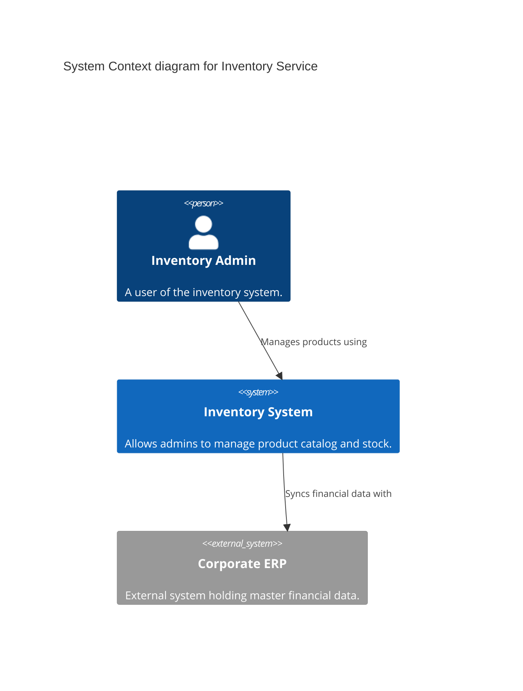
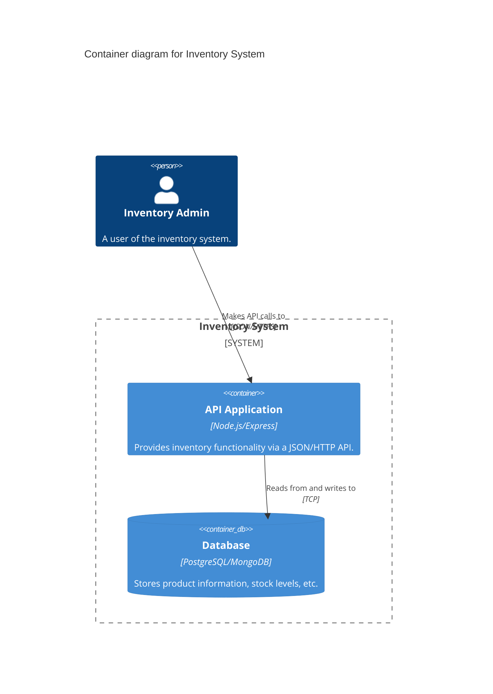
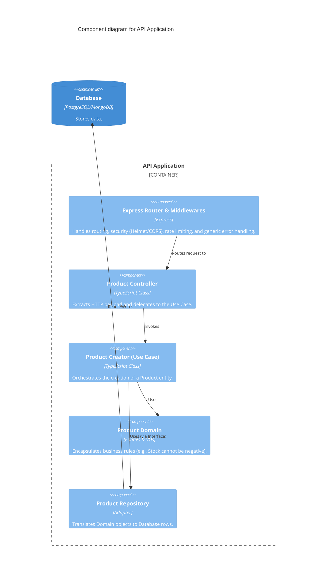

# Architecture Document: Inventory Service

## 1. Introduction
This document outlines the architectural decisions, structure, and enterprise capabilities of the Inventory Service. The system is designed following modern architectural principles to ensure scalability, maintainability, resilience, and security, particularly suited for highly regulated environments (e.g., Banking, Fintech).

---

## 2. Core Architectural Principles & Decisions

### 2.1. Domain-Driven Design (DDD) & Hexagonal Architecture
*   **Decision:** The application is structured using DDD and Hexagonal Architecture (Ports and Adapters).
*   **Rationale:** To isolate the core business logic (Domain) from external concerns (Frameworks, Databases, UIs). This ensures that business rules are agnostic to technology choices.
*   **Implementation:**
    *   **Domain:** Contains Entities (`Product`), Value Objects (`ProductId`, `ProductName`), and Repository Interfaces. Free of any external dependency (no Express, no DB drivers).
    *   **Application:** Contains Use Cases (`ProductCreator`). Orchestrates the domain objects.
    *   **Infrastructure:** Contains implementations (Express Controllers, InMemory/SQL Repositories, DI Container).

### 2.2. Inversion of Control (Dependency Injection)
*   **Decision:** Use `TSyringe` as the IoC Container.
*   **Rationale:** Decouples object creation from object consumption. Promotes testability by allowing easy mocking of dependencies (e.g., swapping a real database for an in-memory one during tests) and adheres to the Dependency Inversion Principle (SOLID).
*   **Implementation:** Dependencies are injected via constructor using `@injectable()` and `@inject()` tokens. The `server.ts` acts as the composition root.

### 2.3. Resiliency & Centralized Error Handling
*   **Decision:** Global Error Handling Middleware with typed Domain Errors.
*   **Rationale:** Prevents information leakage (stack traces) to the client, reduces code duplication in controllers, and ensures consistent API responses.
*   **Implementation:**
    *   Custom `DomainError` hierarchy (`InvalidArgumentError`).
    *   Express `ErrorHandler` middleware intercepts all next(error) calls, mapping business errors to 4xx HTTP codes and technical errors to generic 500 codes.

### 2.4. Observability
*   **Decision:** Structured Logging using `Pino` and `pino-http`.
*   **Rationale:** Plain text logs (`console.log`) are unsearchable in production. Structured JSON logs allow centralized log management systems (e.g., Datadog, ELK) to parse, index, and alert on application behavior efficiently.
*   **Implementation:** A central `Logger` singleton is used. `pino-http` intercepts every HTTP request to generate an access log with latency metrics.

### 2.5. Zero-Trust Boundary (Input Validation)
*   **Decision:** Validation at the edges using Data Transfer Objects (DTOs) with `class-validator`.
*   **Rationale:** Protects the inner layers from malformed data and malicious payloads (Fail-Fast principle). The Domain should only receive data that is structurally sound.
*   **Implementation:** A generic `validationMiddleware` validates incoming requests against defined DTOs (`ProductPut.dto.ts`) before they reach the controller.

### 2.6. Configuration Management (12-Factor App)
*   **Decision:** Strongly typed and validated configuration object.
*   **Rationale:** Environment variables stringly-typed and scattered across the codebase lead to runtime crashes.
*   **Implementation:** A `Config` class loads `.env` variables and validates them synchronously at startup. If configuration is invalid, the application refuses to start (Fail-Fast).

### 2.7. Passive Security & Traffic Control
*   **Decision:** Implementation of `helmet`, `cors`, and `express-rate-limit`.
*   **Rationale:** Protects against common web vulnerabilities (XSS, Clickjacking), controls resource sharing, and mitigates volumetric attacks (DDoS, Brute Force).

---

## 3. C4 Model Diagrams
*(Note: Render these diagrams using tools like Structurizr, PlantUML, or Mermaid)*

### 3.1. Context Diagram (Level 1)

### 3.2. Container Diagram (Level 2)

### 3.3. Component Diagram (Level 3 - API Application)

---

## 4. Enterprise Architecture Pillars (Highly Regulated Environments)

To transition this service from a "robust microservice" to a fully compliant asset in a regulated environment (like Banking/Fintech), the following Enterprise Pillars must be integrated:

### 4.1. Identity and Access Management (IAM)
*   **Requirement:** Zero-trust architecture requires knowing *who* is making the request and *what* they are allowed to do.
*   **Implementation:**
    *   Integration with an Identity Provider (IdP) like Okta, Keycloak, or Auth0.
    *   Middleware to validate JWT (JSON Web Tokens) or OAuth2.0 tokens.
    *   Role-Based Access Control (RBAC) or Attribute-Based Access Control (ABAC) implemented at the Use Case or Controller level.

### 4.2. Auditability & Compliance (Audit Logging)
*   **Requirement:** In banking, every state change must be traceable to a user, timestamp, and context (non-repudiation).
*   **Implementation:**
    *   Beyond technical logging (Pino), implement **Audit Logs**.
    *   Store "Before" and "After" states of entities.
    *   Logs must be immutable (e.g., forwarded to WORM storage - Write Once Read Many).

### 4.3. Data Security (Encryption & Secrets Management)
*   **Requirement:** Personally Identifiable Information (PII) or sensitive financial data must be protected at rest and in transit.
*   **Implementation:**
    *   **In Transit:** TLS 1.2+ minimum strictly enforced (usually at the Load Balancer/Ingress level).
    *   **At Rest:** Database level encryption (TDE).
    *   **Secrets:** Move `.env` files to an Enterprise Secrets Manager (e.g., HashiCorp Vault, AWS Secrets Manager). The app should fetch database credentials dynamically at startup, avoiding hardcoded secrets entirely.

### 4.4. High Availability & Disaster Recovery (Business Continuity)
*   **Requirement:** The system must survive hardware failures and datacenter outages.
*   **Implementation:**
    *   **Statelessness:** The Node.js app is already stateless (thanks to the architecture), making it horizontally scalable via Kubernetes.
    *   **Graceful Shutdown:** Implement `SIGTERM`/`SIGINT` handlers to drain active HTTP requests before the container shuts down to prevent dropped transactions during deployments.
    *   **Health Checks:** Implement `/health/liveness` and `/health/readiness` endpoints for orchestrators (k8s) to route traffic appropriately.

### 4.5. Event-Driven Architecture (Event Sourcing)
*   **Requirement:** Microservices in banking often need to react to changes asynchronously (e.g., When stock drops, trigger an email alert; when a product is created, sync with the Mainframe).
*   **Implementation:**
    *   Publish "Domain Events" (e.g., `ProductCreatedEvent`) to a message broker like Apache Kafka or AWS EventBridge.
    *   This decouples the inventory service from downstream systems, increasing overall enterprise resilience.
